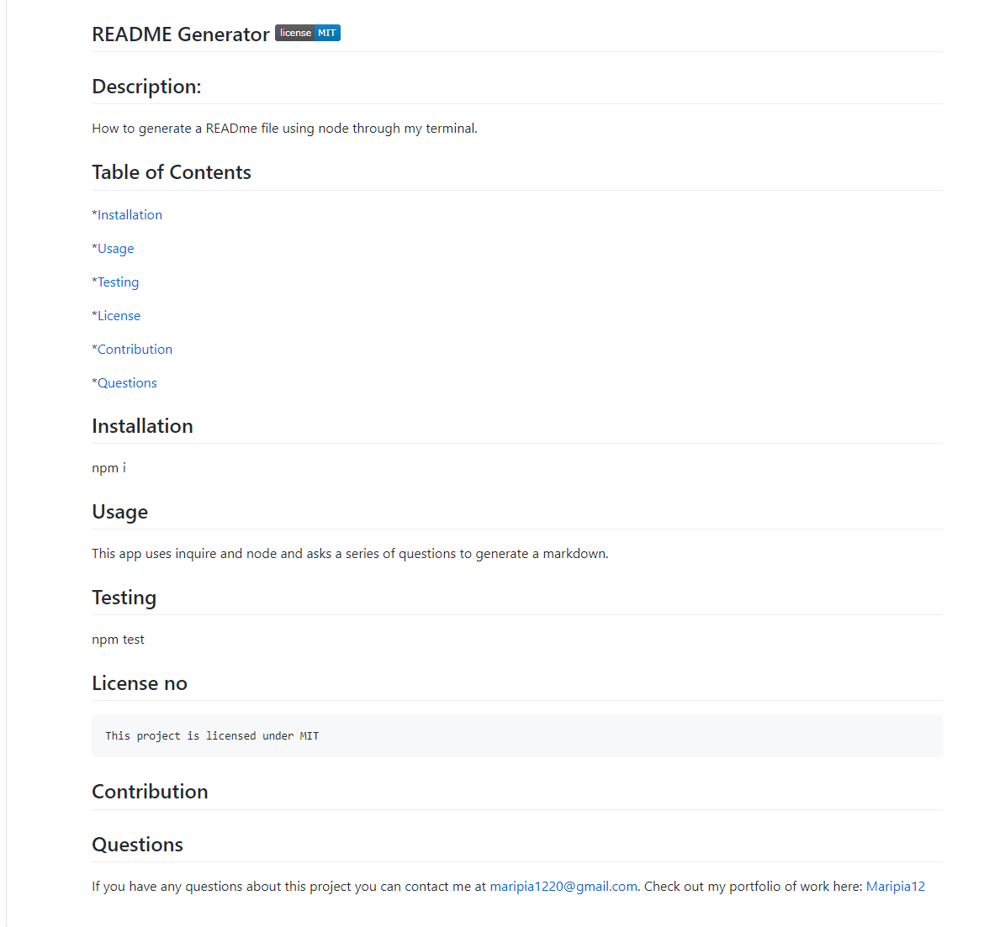

# ReadMe-Generator

## Objective: 
To generate a README file by using node through my terminal. The command-line will accept the users input when prompted for information to generate a professional README.md with a Title section, Description, Table of 
Contents, Installation, Usage, License, Contributing, Tests and Questions.

## Details:

* I first type on the terminal: node .\index.js and then I'm prompt with the first question: Title of project.

* Additional questions follow regarding: Description, Installation Instructions, Usage Information, Contribution Guidelines and Test Instructions.

* As I type in the answers through tge terminal, the information gathered is added to the corresponding sections of the ReadMe file.

* When I choose a license from a list of options, then a badge for that license is added near the top of my ReadMe file. 

* When the I enter my GitHub username, then is added to the section of the ReadMe entitled Questions with a link to my GitHub profile.

* When I enter my email address, then it will also be added to the Questions section of the ReadMe file with instructions on how to reach me with additional questions.

* When I click on the links of the Table of Contents then I'm taken to the corresponding section of the ReadMe.

---

 
